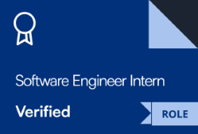
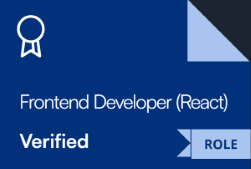

    
    

    

<h3>🧑‍💻 About Me</h3>

    <li>I love working on unique and novel ideas and contributing to projects.</li>
    <li>Currently learning <strong>Rust</strong> and its application in systems programming.</li>
    <li>Let's collaborate on some interesting <strong>projects</strong>.</li>
    <li>I'm interested in <strong>machine learning</strong>, <strong>blockchain</strong> and <strong>cybersec</strong></li>
    <li>I also like philosophy!</li>
     

<h2 align="center">🛠️ Tech Stack</h2>
<table border="0" cellpadding="10">
    <tr>
        <td></td>
        <td></td>
        <td></td>
        <td></td>
        <td></td>
        <td></td>
        <td></td>
        <td></td>
        <td></td>
    </tr>
</table>

<table border="0" cellpadding="10">
    <tr>
        <th colspan="6" align="center">Tools & Platforms</th>
    </tr>
    <tr>
        <td></td>
        <td></td>
        <td></td>
        <td></td>
        <td></td>
        <td></td>
    </tr>
</table>

<table border="0" cellpadding="10">
    <tr>
        <th colspan="8" align="center">Familiar</th>
    </tr>
    <tr>
        <td></td>
        <td></td>
        <td></td>
        <td></td>
        <td></td>
        <td></td>
        <td></td>
    </tr>
    <tr>
        <td></td>
        <td></td>
        <td></td>
        <td></td>
        <td></td>
        <td></td>
        <td></td>
    </tr>
</table>

<h2 align="center">🚀 Featured Projects</h2>
<table width="100%" border="0">
    <tr>
        <td width="50%" valign="top">
            <h3><a href="https://github.com/viswajith-ks/aegis-docs">🛡️ Aegis Docs</a></h3>
            
<strong>A privacy-first document management app built with Flutter.</strong>

            <ul>
                <li><strong>End-to-end AES-256 encryption</strong> for secure cloud synchronization.</li>
                <li><strong>Native PDF compression</strong> using a compiled MuPDF library.</li>
                <li>Built on an <strong>MVVM architecture</strong> for a scalable UI design.</li>
                <li>Leverages <strong>concurrent computing</strong> with Dart Isolates for performance.</li>
                <li>Integrated with the <strong>Google Drive API</strong> for seamless cloud sync.</li>
                <li><strong>Automatic Cleanup:</strong> Regularly clears temporary and cached files.</li>
            </ul>
        </td>
        <td width="50%" valign="top">
            <h3><a href="https://github.com/viswajith-ks/turing-machine">🤖 Turing Machine Simulator</a></h3>
            
<strong>An interactive command-line Turing machine simulator in Java.</strong>

            <ul>
                <li><strong>Configurable transition functions</strong> with step-by-step execution.</li>
                <li><strong>Interactive definition system</strong> with robust input validation.</li>
                <li><strong>Real-time tape state visualization</strong> during simulation.</li>
                <li><strong>Colored outputs</strong> for enhanced readability in the console.</li>
                <li><strong>Pure Java implementation</strong> following a clean architecture.</li>
            </ul>
        </td>
    </tr>
</table>

<h2 align="center">🏆 HackerRank Certifications</h2>
😅

    
    

⭐️ From <a href="https://github.com/viswajith-ks">viswajith-ks</a>

